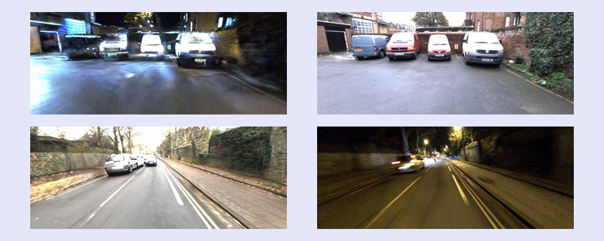
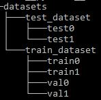

# Day2Night GAN Project


## Table of contents
* [General info](#general-info)
* [Prerequisite](#prerequisite)
* [Setup](#setup)

## General info
This project is the GAN implementation in transforming <br>
the day to night scene or vice versa. This project based on <br><br>
**Night-to-Day Image Translation for Retrieval-based Localization** <br>
Originally by Asha Anoosheh, Torsten Sattler, Radu Timofte, Marc Pollefeys, 
Luc van Gool In Arxiv, 2018. <br>
https://github.com/AAnoosheh/ToDayGAN <br>
	
## Prerequisite
Before using the program, make sure you already have 
installed the following software:
* Anaconda Navigator
* cuDNN
* CUDA

## Dataset management
<br>
This program can be used to train new model or just test the existing model.<br> 
* For reference, 0-type directories (`train0`, `val0`, `test0`) are used to store the daytime images, meanwhile 1-type directories (`train1`, `val1`, `test1`) are used to store the nighttime images. No correlation needed between images. <br>
* To train the model, move your dataset into `dataset/train_dataset` dir. Make sure of the proper distribution for **train** and **val** the model. <br>
* To test the model, move your dataset into `dataset/test_dataset` dir. The result will be saved inside `results` directory. <br>
* Because of the sensitivity to instrinsic camera characteristics, testing should ideally be on the same **Oxford dataset photos** (and same Grasshopper camera) found conveniently preprocessed and ready-to-use [HERE](https://data.ciirc.cvut.cz/public/projects/2020VisualLocalization/RobotCar-Seasons/images/). The `overcast-reference.zip` is the daytime images, meanwhile `night.zip` and `night-rain.zip` is the nighttime images. Download, extract, and put them into the proper folder (train/val/test folder) based on your needs<br>
* One of author's **pretrained models** for the Oxford Robotcars dataset can be found [HERE](https://www.dropbox.com/s/mwqfbs19cptrej6/2DayGAN_Checkpoint150.zip?dl=0). Download all of the files, extract, and place under `./checkpoints/robotcar_2day`.
* If using this pretrained model, `datasets/test_dataset` should contain two subfolders `test0` & `test1`, containing Day and Night images to test. `test0` can be empty if you do not care about Day image translated to Night, but just needs to exist to not break the code.


## Setup
To run this project, open the Anaconda Prompt then 
do the following commands:

```
$ cd <project folder>
$ conda create -n day2night python=3.8 notebook
$ conda activate day2night
$ jupyter-notebook
```
The step-by-step methods are explained inside the notebook file

